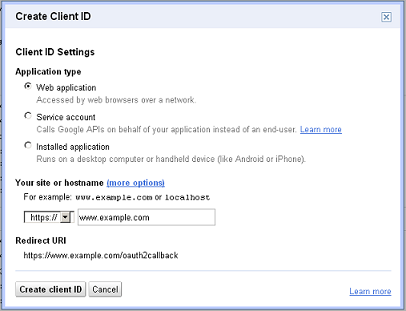
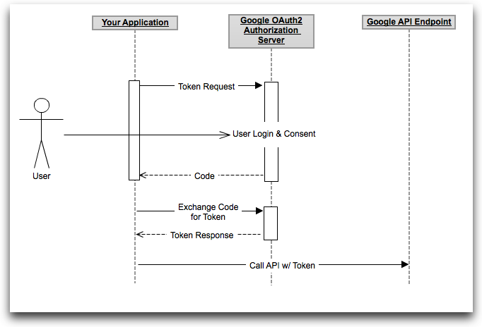
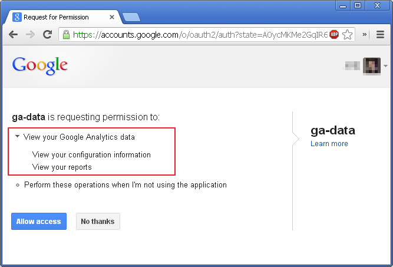

name: inverse
layout: true
class: inverse

---
class: center middle

# Google OAuth2 及 Analytics Data API 的应用
&lt; greatghoul - 西安GDG - 2013/03 &gt;  

.footnote[ http://www.g2w.me - Ask and learn.]

---
class: center middle

---
class: menu

# 额外的准备

 * VPN (全局, <strike>OpenVPN-</strike>)
 * SSH
 * GoAgent
 * ShadowSocks
 
---

class: menu

# 注册服务授权

访问 https://code.google.com/apis/console/ 

.pull-right[
 
]

 * 创建 Project
 * Oauth Toekn
 * API Key?
 * .red[按需选权限]
 * .red[不滥用权限]

.footnote.right[.bold[\*] [ SkillPages利用用户授权滥用联系人信息][^1]]

[^1]: http://g2w.me/2013/03/skillpages-sucks/

---

# Google Oauth2 验证流程

---
class: menu

# Google Oauth2 验证流程

 1. 创建配置文件
 2. 应用请求授权
 3. 用户确认授权
 4. 应用验证授权

---

# 一、创建配置文件

`client_secrets.json`

    {
      "installed": {
        "client_id": "INSERT CLIENT ID HERE",
        "client_secret": "INSERT CLIENT SECRET HERE",
        "redirect_uris": ["INSERT REDIRECT URI"],
        "auth_uri": "https://accounts.google.com/o/oauth2/auth",
        "token_uri": "https://accounts.google.com/o/oauth2/token"
      }
    }

---

# 二、应用请求授权

安装 google-api-python-client

    sudo pip install google-api-python-client

加载配置文件

    .python
    # The file with the OAuth 2.0 Client details for authentication and authorization.
    CLIENT_SECRETS = os.path.join(os.path.dirname(__file__), 'client_secrets.json')

    # A helpful message to display if the CLIENT_SECRETS file is missing.
    MISSING_CLIENT_SECRETS_MESSAGE = '%s is missing' % CLIENT_SECRETS

    # The Flow object to be used if we need to authenticate.
    FLOW = flow_from_clientsecrets(filename=CLIENT_SECRETS, \
                                   scope='https://www.googleapis.com/auth/analytics.readonly', \
                                   redirect_uri='http://localhost:5000/oauth2callback', \
                                   message=MISSING_CLIENT_SECRETS_MESSAGE)
                                   
生成令牌并请求验证

    .python
    FLOW. params['state'] = xsrfutil.generate_token(SECRET_KEY, 'ga-data')
    authorize_url = FLOW.step1_get_authorize_url()
    return redirect(authorize_url) # Flask

---

# 三、用户确认授权

 

---

# 四、应用验证授权

    .python
    @app.route('/oauth2callback', methods=['GET'])
    def oauth2callback():
        app.logger.info('oauth2callback with state: %s' % request.args.get('state'))
        if not xsrfutil.validate_token(SECRET_KEY, request.args.get('state'), 'ga-data'):
            return  'Bad request'
        else:
            app.logger.info('Authorize successfull, store credentials into session')
            credentials = FLOW.step2_exchange(request.args)
            session['credentials'] = credentials.to_json() # 保存证书 
            return redirect("/")
            

授权证书的持久化

 * LocalStorage
 * Session
 * Database

---

# 使用证书访问 Data API

实例化保存的证书

    .python
    credentials = session.get('credentials')
    credentials = credentials and OAuth2Credentials.from_json(credentials) or None
    
建立 Data API Connection

    .python
    def initialize_service(credentials):
        app.logger.info('Initilize analytics service instance with credentials')
        http = httplib2.Http()
        http = credentials.authorize(http)    # authorize the http object
        return build('analytics', 'v3', http=http)

调用 Data API

    .python
    service.data().ga().get(ids='ga:' + args.get('profile_id'),
                            start_date=args.get('start_date'),
                            end_date=args.get('end_date'),
                            max_results=15,
                            dimensions=args.get('dimensions'),
                            metrics=args.get('metrics'),
                            sort=args.get('metrics').replace('ga:', '-ga:')).execute()

                            
---

# 参考资料

Oauth2

 * [Using Google OAuth2 with Flask](http://stackoverflow.com/a/12918081/260793)
 * [Using OAuth 2.0 for Web Server Applications](https://developers.google.com/accounts/docs/OAuth2WebServer)
 * [Google Data API Document](https://developers.google.com/gdata/)
 * [Flask-OAuth](https://github.com/mitsuhiko/flask-oauth)

Google Data API

 * [Google Analytics Data API](https://developers.google.com/analytics/)
 * [Google APIs Client Library for Python - Project Page](https://code.google.com/p/google-api-python-client/)
 * [Google APIs Client Library for Python - Document](http://google-api-python-client.googlecode.com/hg/docs/epy/index.html)

Tools
 
 * [Oauth2.0 Playground](https://developers.google.com/oauthplayground/)
 * [Google Analytics Query Explorer 2](https://ga-dev-tools.appspot.com/explorer/?hl=en)

---

name: last-page
template: inverse
class: center middle

## Thank you!
Slideshow created using [remark](http://github.com/gnab/remark).
